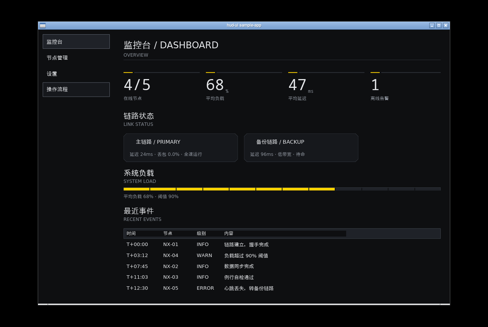
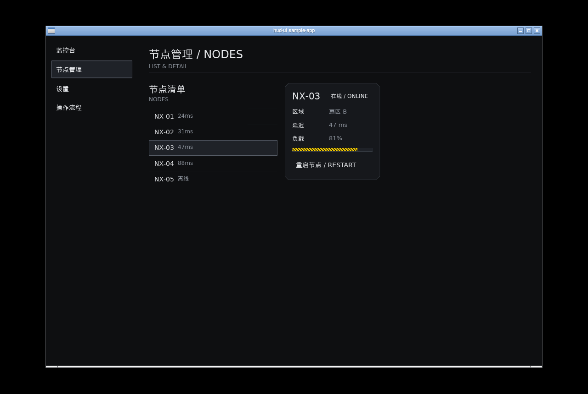
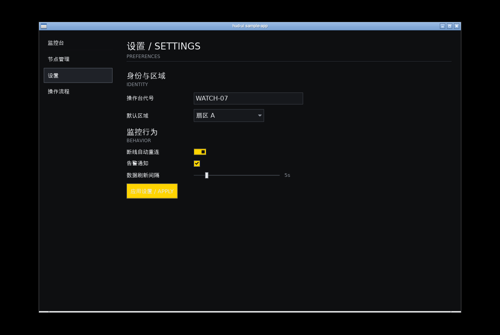
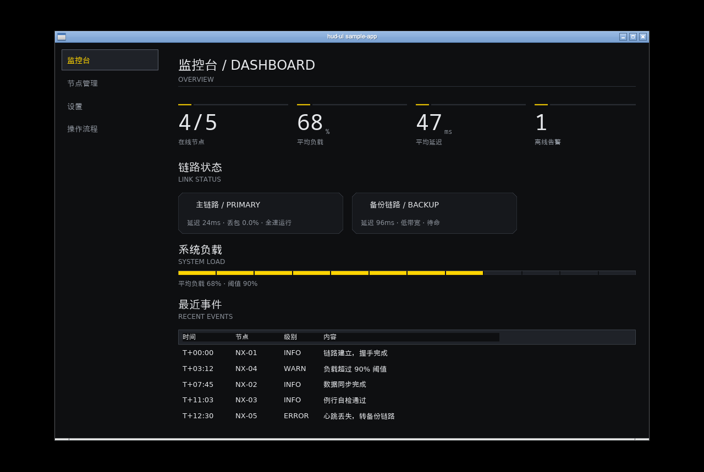

# hud-ui

A "HUD-style" desktop UI widget library for [iced 0.14](https://github.com/iced-rs/iced)
(dark surfaces, hairlines, 45° chamfers, restrained accent colors), targeting
Windows 10 22H2 / 11 desktop apps. Linux is supported as a development and demo
platform (X11/Wayland + software rendering fallback).

> The visual style takes inspiration from the interface language of a specific
> sci-fi game. **No** art assets, logos, fonts, or names from that game are used.

**English** | [简体中文](README.zh-CN.md)

## Repository layout

| Directory | Contents |
|---|---|
| `code/` | Source code (Cargo workspace: 7 crates + 3 demo apps) |
| `doc/` | Design docs, ADRs, progress log, and milestone screenshots |

`dev/` (local toolchain/cache) and `dist/` (release artifacts) are local-only
convention and are not part of the repository.

## Workspace structure

```
code/
crates/
  hud-tokens    Design tokens (pure data, serde, loadable from files)
  hud-core      Shape geometry / pixel snapping / ChamferedBox custom widget
  hud-theme     HudTheme and Catalog styling for 13 built-in widgets
  hud-widgets   Widgets (panel/card/button variants/decor/prelude+macros)
  hud-icons     Embedded SVG icons (feature-gated)
  hud-platform  Platform integration (window operations; Windows-specific
                calls isolated here)
  hud-testkit   Test helpers
apps/
  gallery       Widget gallery (widget × state walkthrough, live theme reload)
  sample-app    Sample application (dashboard / nodes / settings / dialogs)
  proto         M0 prototype (chamfer + custom theme smoke test)
```

Dependency direction is one-way: `tokens → core → theme → widgets`;
`icons` / `platform` are side branches.

## Quick start

Requirements: stable Rust ≥ 1.88 (see `code/rust-toolchain.toml`).

```bash
cd code

# Build & test
cargo test --workspace

# Run the gallery (on a headless Linux box: Xvfb + software rendering)
export DISPLAY=:99 ICED_BACKEND=tiny-skia
cargo run -p gallery
# Sample app:
cargo run -p sample-app
#   On Windows: cargo run -p gallery (wgpu by default)

# Live theme reload (debug builds only):
# edit code/assets/theme/dark.toml while the gallery is running
```

Note: `code/.cargo/config.toml` replaces crates.io with the rsproxy.cn mirror
(the development environment cannot reach crates.io directly). If you don't
need the mirror, remove the `[source.*]` sections from that file.

## Usage example

```rust
use hud_widgets::{column, prelude::*, button, ButtonVariant, typography};

fn view(state: &State) -> hud_widgets::Element<'_, Message> {
    column![
        typography::section_header("OPERATIONS", "OPS"),
        button(text("START").size(14))
            .padding(10)
            .on_press(Message::Start)
            .class(button::class(ButtonVariant::Primary)),
    ]
    .spacing(16)
    .into()
}

fn main() -> iced::Result {
    iced::application(State::new, State::update, State::view)
        .theme(|_: &State| hud_theme::HudTheme::dark())
        .run()
}
```

Notes for iced 0.14 with a custom theme (see `doc/ADR-001-主题架构.md`):

- Use `hud::column! / row! / stack!` for layout (the standard macros pin child
  element themes to `iced::Theme`);
- Pass `Box::new(f) as XxxStyleFn` to `.class()`, or use the built-in classes.

## Status

See [doc/PROGRESS.md](doc/PROGRESS.md) (M0–M6 complete, with screenshots).

## Design & development docs

- [Design spec (设计规范)](doc/设计规范.md): colors, spacing, fonts, geometry, motion.
- [Widget API (组件API)](doc/组件API.md): widget intent, constructors, state flow.
- [Migration guide (迁移指南)](doc/迁移指南.md): the iced pin and upgrade checklist.
- [New widget guide (新组件开发指南)](doc/新组件开发指南.md): dependency direction,
  tokens, caches, and validation conventions.

## Sample app

Four-page demo covering a dashboard, node list + detail, settings form, and
confirm / error / loading flows.

| Dashboard | Nodes | Settings | Dialog flow |
|---|---|---|---|
|  |  |  |  |

## Quality gate

```bash
cd code && ./scripts/check.sh   # fmt --check + clippy -D warnings + test
```

## License

Licensed under the [Apache License 2.0](LICENSE).

Note for distributors: Linux builds may embed the Cantarell font via the
`sctk-adwaita` crate (SIL Open Font License 1.1). Keep the font's copyright and
license notice together with any redistribution of the binaries.
